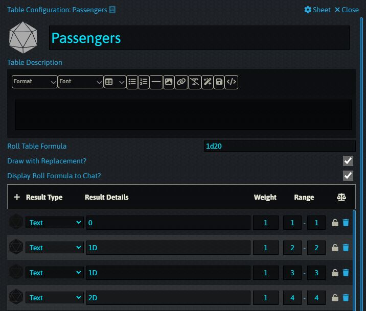
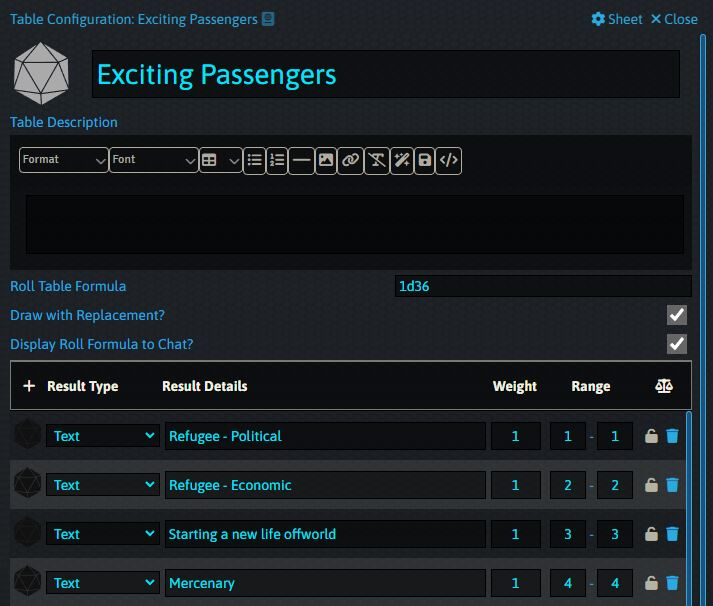
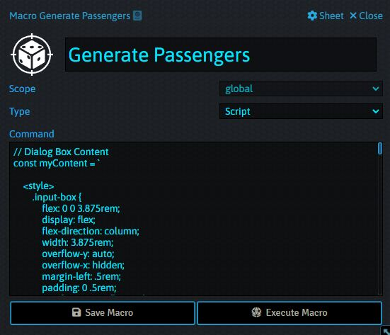
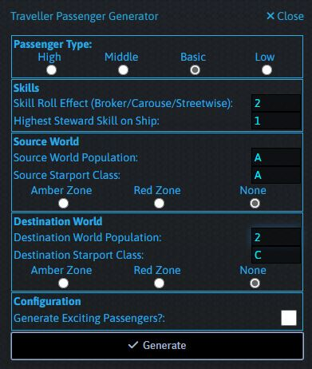
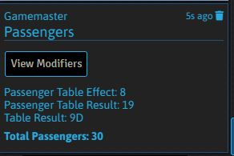
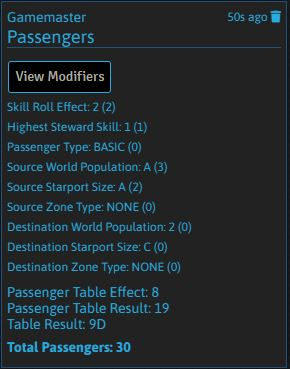
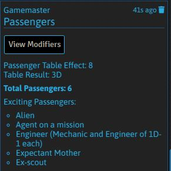

# Generate Passengers Macro

## Description

This macro will generate an amount of passengers for you based on the configuration you provide. It does not care about passenger types but will take into account High/Low Passengers for the purposes of determining the table lookup.

## Requirements

You will need to create a Roll table called "Passengers" based on the Passenger Traffic table on page 207 of the core rules. The code expects the table to be of range 1 - 20. 

Optionally you can create a table called "Exciting Passengers" with data from the Random Passenger table on page 209. This table is rolled against with an unmodified roll so this table can include any descriptions you want, even beyond the D66 provided in the core rules. 

## How To Use

1. Ensure you have created the tables mentioned in the Requirements.

2. Create a new Macro, give it a Type of Script and paste the code from generatePassengers.js into the text box.

3. You can click Execute Macro or click the button in your button bar. This will bring up the interface.

4. You can now add the Passenger configuration such as World Population, Starport Size, Steward Skill and any Skill Checks. Once you're done click Generate. 

# Output

Once you have generated a list of passengers they will be messaged to the GM in the chat window as follows:

You can click the View Modifiers button to see what the modifiers for the table lookup were.

If you generate passengers with Exciting Backgrounds they will be shown below the number of passengers.

